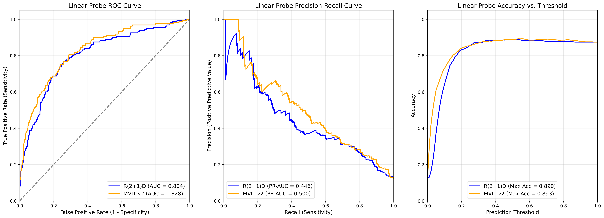
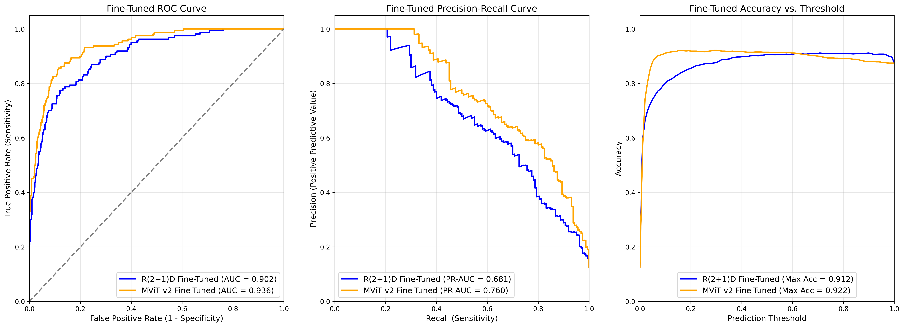

# Resource-Constrained Echocardiogram Video Classification: 3D CNNs vs. Vision Transformers

This project compares the performance of a 3D Convolutional Neural Network (**R(2+1)D-18**) against a Vision Transformer (**MVIT v2 Small**) for classifying **Heart Failure with Reduced Ejection Fraction (HFrEF, EF ≤ 40%)** from echocardiogram videos.

It is designed to evaluate whether Vision Transformers can outperform 3D CNNs on noisy medical videos, and practically demonstrate how both architectures can be effectively trained end-to-end under a strict **6 GB VRAM** hardware constraint using mixed precision and strategic unfreezing.

Full results in Paper `Results.pdf`

---

## Key Results

<div align="center">
  
</div>

<div align="center">
  
</div>


After end-to-end fine-tuning on the echocardiogram domain, the Vision Transformer (**MVIT v2**) significantly outperformed the 3D CNN (**R(2+1)D**). It achieved higher overall discrimination and better sensitivity at the strict clinical operating target (**~90% specificity**).

### Fine-Tuned Model Performance

| Metric | R(2+1)D-18 (Fine-Tuned) | MVIT v2 Small (Fine-Tuned) |
|---|---:|---:|
| ROC-AUC | 0.9020 | 0.9359 |
| PR-AUC | 0.6806 | 0.7596 |
| Sensitivity (@ ~90% Specificity) | 0.7250 | 0.8250 |
| Max Accuracy | ~0.912 | ~0.922 |

> **Note:** During **Phase 1 (Linear Probing on frozen Kinetics-400 features)**, both models performed similarly (**AUC 0.804 vs 0.828**, not statistically significant). This indicated that generic natural-video pretraining acted as a performance bottleneck on speckle-heavy ultrasound data until domain-specific fine-tuning was applied.

---

## What This Reproduces

- **Reproduces:** Findings from the report *"Resource-Constrained Echocardiogram Video Classification: 3D CNNs vs. Vision Transformers Under a 6 GB VRAM Constraint"*
- **Expected outputs:**
  - Evaluation metrics (ROC-AUC, PR-AUC, Sensitivity at ~90% Specificity, Max Accuracy)
  - ROC and Precision-Recall evaluation curves
  - Performance profiling (parameter counts, steps per epoch, and training/inference timings)
- **Scope:** Full pipeline (data validation, Parquet manifest generation, frozen feature extraction + linear probing, and end-to-end fine-tuning)

---

## Project Structure

- `src/` — Core library modules (dataset loaders, PyTorch model wrappers, utilities)
- `scripts/` — Executable Python scripts (`validate_filelist.py`, `build_manifest.py`, `extract_features.py`)
- `data/` — Target directory for the raw dataset and generated Parquet manifest files (git-ignored)
- `features/` — Storage directory for extracted `.pt` embedding tensors (git-ignored)
- `probe_evaluation.ipynb` — Jupyter notebook for training and evaluating the linear probe
- `finetune_evaluation.ipynb` — Jupyter notebook for end-to-end fine-tuning and evaluating the models

---

## Requirements

- **OS:** Windows 11 (recommended for identical performance/timing reproduction)
- **Language/runtime:** Python 3.8+
- **Environment:** `venv` Disclaimer: environment.yml doesn't work currently
- **Hardware requirement:** An NVIDIA GeForce RTX 3050 6GB Laptop GPU was used for this project. Identical hardware is highly recommended to reproduce the exact memory-constrained training dynamics, batch sizes, and epoch timings detailed in the paper.

---

## Installation

### 1) Clone the repo

```bash
git clone https://github.com/yourusername/ecg-hfref-classifier.git
cd ecg-hfref-classifier
```

### 2) Create/restore environment

Create a virtual environment using your preferred tool (for example, `python -m venv venv`) and activate it.

### 3) Install dependencies

```bash
pip install -r requirements.txt
```

> **Note:** An `environment.yml` file is also included in the repository, but it is not fully configured yet. Please rely on `requirements.txt` for setup.

---

## Data

- **Source:** EchoNet-Dynamic Dataset (Stanford University)
- **Access:** Restricted. Users must individually register with Stanford and sign a Data Use Agreement (DUA) to gain access.
- **Setup:** The data is not included in this repository. You must manually download the dataset and extract the contents (specifically the `Videos/` folder and the CSV files) into this repository’s `data/` folder.
- **Notes:** Do not redistribute any portion of the dataset or commit raw patient videos/data to version control.

---

## Workflow & Execution

Once the data is downloaded and placed into the `data/` folder, follow these steps to reproduce the results:

### 1) Data Validation & Preprocessing

First, ensure your downloaded files are uncorrupted and that the structure (column names, ID formats) matches expectations:

```bash
python scripts/validate_filelist.py --dataset-dir data/EchoNet-Dynamic
```

Next, generate the optimized manifest file. This script cross-references the video files with the CSV labels and generates a `.parquet` file containing all the filepaths needed for the training scripts:

```bash
python scripts/build_manifest.py --data-root data/EchoNet-Dynamic --manifest-out data/manifest.json
```

### 2) Run Experiments

After preprocessing, the pipeline branches into two distinct phases (**Linear Probing** vs. **Fine-Tuning**).

#### Path A: Phase 1 (Linear Probe)

This tests the features learned directly from the Kinetics-400 pretraining.

1. Extract the frozen embeddings to your local disk:

   ```bash
   python scripts/extract_features.py --model r2plus1d
   python scripts/extract_features.py --model mvit
   ```
(10-15 minutes on an RTX 3050)
2. Open and run the cells in `probe_evaluation.ipynb` to train the logistic regression classifier and view the linear probe metrics.

#### Path B: Phase 2 (End-to-End Fine-Tuning)

This adapts the models directly to the echocardiogram domain under the **6 GB VRAM** constraint using PyTorch AMP and strategic unfreezing.

1. Open and run all cells in `finetune_evaluation.ipynb`. This notebook handles the end-to-end training loop, clip-averaging for final inference, and generates the final comparative metrics and curves.
Warning: This took me about 2.5 hours to complete on RTX 3050

